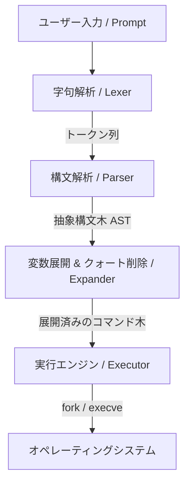

#  Minishell
[](https://en.wikipedia.org/wiki/C_(programming_language))
[](https://opensource.org/licenses/MIT)
[](https://42tokyo.jp/)

ユーザーとオペレーティングシステムを繋ぐ架け橋となる、簡易的な対話型コマンドラインシェル (Command Line Shell) の実装です。  
本プロジェクトは、42のカリキュラムの一部として **yikebata** と **tozaki** によって開発されました。細かな挙動や仕様は GNU Bash を参考に設計されています。

---

##  目次
- [概要](#-概要)
- [特徴 & アーキテクチャ](#-特徴--アーキ架构)
- [実装機能一覧](#-実装機能一覧)
  - [コントロールオペレータ](#コントロールオペレータ)
  - [リダイレクト](#リダイレクト)
  - [ビルトインコマンド](#ビルトインコマンド)
  - [シグナルハンドリング](#シグナルハンドリング)
- [インストール & 使用方法](#-インストール--使用方法)
  - [依存関係の解決](#依存関係の解決)
  - [ビルド手順](#ビルド手順)
  - [実行手順](#実行手順)
- [開発用デバッグビルド](#-開発用デバッグビルド)
- [リファレンス & 参考文献](#-リファレンス--参考文献)

---

##  概要
`Minishell` は、Unix/Linux 環境においてコマンドを入力・実行するためのプログラムです。
構文解析を行い、抽象構文木 (AST) を構築し、環境変数の展開やリダイレクトの適用を経て、システムコール `fork` および `execve` を用いてプロセスを実行します。

---

##  特徴 & アーキテクチャ

`Minishell` はモジュール化されたパイプライン処理により、ユーザー入力を安全かつ正確に解釈して実行します。



1. **Lexer (字句解析)**: 入力文字列を「言葉」の単位（トークン）に切り分けます。
2. **Parser (構文解析)**: トークン同士の優先順位を解釈し、実行単位を定義する抽象構文木 (AST: Abstract Syntax Tree) を構築します。
3. **Expander (変数展開)**: 環境変数の参照 (`$VAR`) や、終了ステータス (`$?`) の展開、クォート (`'`, `"`) の除去を行います。
4. **Executor (実行処理)**: パイプラインの構築、リダイレクトの設定を行い、最終的にシステムコールを通じてコマンドを実行します。

---

##  実装機能一覧

### コントロールオペレータ
| オペレータ | 説明 | 使用例 |
| :---: | :--- | :--- |
| **Pipeline (`\|`)** | 前のコマンドの標準出力を、後ろのコマンドの標準入力へ繋ぎます。 | `ls -la \| grep txt` |
| **list (`;`)** | コマンドを順番に連続して実行します。 | `mkdir test; cd test` |

### リダイレクト
| 記号 | タイプ | 説明 |
| :---: | :--- | :--- |
| **`<`** | 入力リダイレクト | ファイルから標準入力を読み込みます。 |
| **`>`** | 出力リダイレクト（上書き） | コマンドの出力をファイルに書き込みます（上書き）。 |
| **`>>`** | 出力リダイレクト（追記） | コマンドの出力をファイルに追記します。 |
| **`<<`** | ヒアドキュメント | デリミタ（終端文字列）が入力されるまでの複数行の入力をコマンドに引き渡します。 |

> [!NOTE]
> ヒアドキュメント (`<<`) は、SIGINTによる入力中断に正しく対応しており、一時ファイルと適切なパイプライン制御によって安全に処理されます。詳細な設計については、[docs/heredoc](docs/heredoc/README.md) の設計書を参照してください。

### ビルトインコマンド
Bashと同様に、プロセスをフォークせずにシェル自体が直接処理を行う以下のビルトインコマンドを完備しています。

| コマンド | 説明 | 主なサポートオプション・挙動 |
| :--- | :--- | :--- |
| **`echo`** | 引数として与えられた文字列を出力します。 | 改行を抑制する `-n` オプション（`-nnnn` など複数指定可）に対応。 |
| **`cd`** | カレントワーキングディレクトリを変更します。 | 引数なしで `HOME` へ移動、`-` で `OLDPWD` への移行、および環境変数 `PWD`/`OLDPWD` の自動更新に対応。 |
| **`pwd`** | 現在作業しているディレクトリの絶対パスを表示します。 | 常に正確な物理パスを出力します。 |
| **`export`** | 新しい環境変数を設定、または既存の変数をエクスポートします。 | 引数なしの場合、エクスポートされた環境変数を `declare -x name="value"` の形式でアルファベット順に出力。 |
| **`unset`** | 指定された環境変数を取り消し（削除）します。 | シェル及び子プロセスから環境変数を除外します。 |
| **`env`** | 現在設定されている環境変数の一覧（名前と値のペア）を表示します。| 値を持つ環境変数のみを出力します。 |
| **`exit`** | シェルプログラムを終了します。 | 引数として終了コードを受け取るほか、非数値などの例外的な引数エラーにも対応。 |

### シグナルハンドリング
対話型シェルにおけるユーザーからの割り込み操作を制御します。

| 入力キー | シグナル | 対話（プロンプト）時の挙動 |
| :---: | :--- | :--- |
| **`Ctrl + C`** | `SIGINT` | 入力中の行をクリアし、改行して新しいプロンプトを表示します。終了ステータス `$?` には `130` がセットされます。ヒアドキュメント入力中は処理を速やかに中断します。 |
| **`Ctrl + \`** | `SIGQUIT` | 通常の対話モードでは完全に無視されます (`SIG_IGN`)。子プロセスの実行中は、子プロセスを強制終了させます。 |
| **`Ctrl + D`** | `EOF` | 入力ストリームの終端を検知し、シェルを正常終了 (`exit 0`) します。 |

---

##  インストール & 使用方法

### 依存関係の解決
本プロジェクトは行編集およびヒストリ管理のために `GNU Readline` ライブラリを使用しています。ビルドする前にインストールを行ってください。

* **Debian/Ubuntu系:**
  ```bash
  sudo apt-get install libreadline-dev
  ```
* **macOS (Homebrew):**
  ```bash
  brew install readline
  ```

### ビルド手順
リポジトリのルートで `make` を実行すると、コンパイルが開始され実行ファイル `minishell` が生成されます。

```bash
make
```

### 実行手順

#### 対話型シェルの起動
```bash
./minishell
```

#### スクリプトのパイプ入力による非対話実行
```bash
echo "echo Hello Minishell; pwd" | ./minishell
```

---

##  開発用デバッグビルド
パーサーの動作やトークン解析結果を確認するためのデバッグ用ターゲットも用意されています。

* **デバッグビルドの生成:**
  ```bash
  make debug
  ```
* **デバッグ版の実行:**
  ```bash
  make run-debug
  ```

---

##  リファレンス & 参考文献
開発にあたり、以下のリソースおよびアーキテクチャを参考にしました。

*  **[GNU Bash Manual / features](https://www.gnu.org/savannah-checkouts/gnu/bash/manual/bash.html)**  
  [https://www.gnu.org/savannah-checkouts/gnu/bash/manual/bash.html]
  GNU公式による Bash の仕様解説。パーサーの優先順位や各種機能の要件の理解に利用。
*  **[xv6-riscv](https://github.com/mit-pdos/xv6-riscv)**  
  [https://github.com/mit-pdos/xv6-riscv]
  MIT が開発した教育用 Unix 互換 OS。抽象構文木を用いたコマンド実行やツリー走査の設計を参考にしました。
*  **[低レイヤを知りたい人のためのCコンパイラ作成入門](https://www.sigbus.info/compilerbook)**  
  [https://www.sigbus.info/compilerbook]
  抽象構文木 (AST) や再帰下降構文解析の基礎的な理解、およびデータ構造設計の基礎として利用しました。
